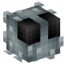
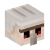
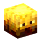

# MobGear Plugin

**MobGear** adds new gear with special abilities, custom mob heads, and more to enhance your Minecraft server experience! ⚡

****
## Features:

• **Menus** 📜  

    • Unique, professional menus with a clean and smooth layout for the forge. 🎮✨  
    • Enjoy an intuitive user interface for easy navigation!

• **New Gear** ⚔️

    • Equip mobs with gear that has special abilities, creating exciting new challenges and a unique PVP experience. 💥

• **Mob Heads** 🧠  

    • Add unique mob heads to your server, improving visuals and gameplay. 🎯

• **Commands** ⌨️  

    • Use custom commands to easily manage and customize the plugin. 🔧

• **Customization** ⚙️  

    • Configure settings to make your server truly unique. 🌟

****
## All Mob Heads:

### • **Silverfish**

#### • Head-drop chance of this mob:

    • 0.0001% OR 1 / 10.000 mobs.

#### • This Mob Gear set grants these perks:

    • Speed I 
    • Strength I  
    • Health Boost IV

---

### • **Iron Golem**
#### • Head-drop chance of this mob:

    • 0.000142857% OR 1 / 7.000 mobs.
#### • This Mob Gear set grants these perks:

    • Speed I 
    • Regeneration II
    • Strength I

---

### • **Blaze**
#### • Head-drop chance of this mob:

    • 0.0002% OR 1 / 5.000 mobs.
#### • This Mob Gear set grants these perks:

    • Fire Resistance I
    • Speed I
    • Resistance II

---

### • **Slime**
#### • Head-drop chance of this mob:

    • 0.000333333% OR 1 / 3.000 mobs.
#### • This Mob Gear set grants these perks:

    • Slowness I  
    • Jump Boost I  
    • Jump Boost II

---

### • **Chicken**
#### • Head-drop chance of this mob:

    • 0.000666667% OR 1 / 1.500 mobs.
#### • This Mob Gear set grants these perks:

    • Slow Falling 
    • Speed I 
    • Strength II 
    
    
